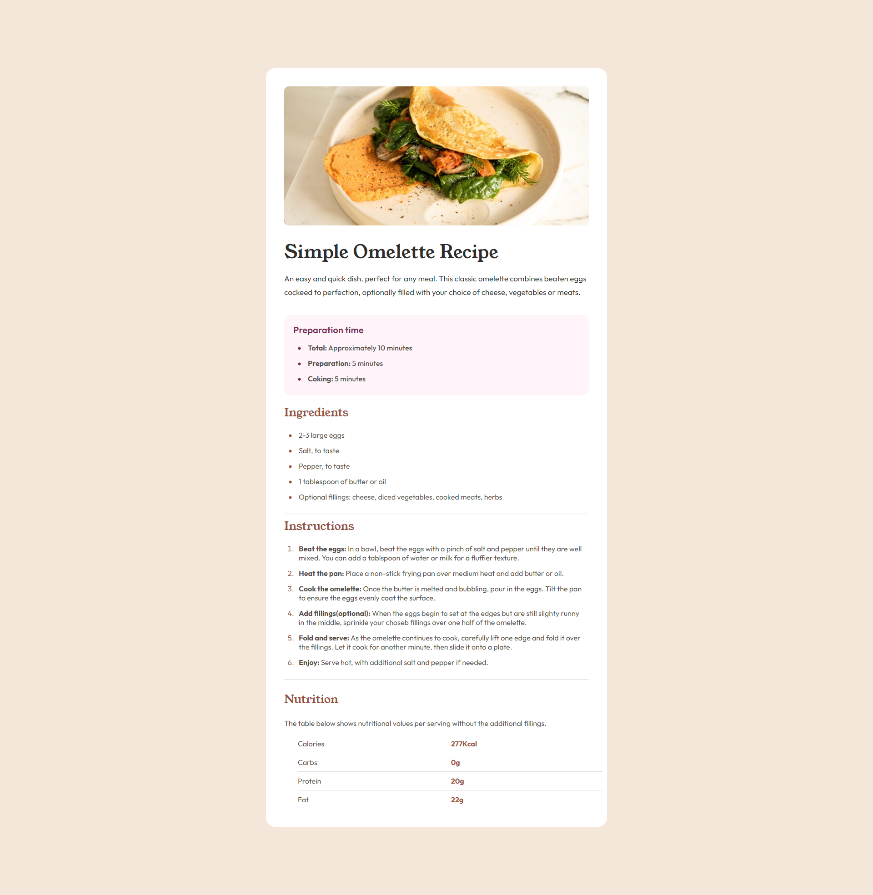

# Frontend Mentor - Recipe page solution - pablodev

Made by pablodev a fullstack developer in training

This is a solution to the [Recipe page challenge on Frontend Mentor](https://www.frontendmentor.io/challenges/recipe-page-KiTsR8QQKm). Frontend Mentor challenges help you improve your coding skills by building realistic projects. 


## Overview

### Screenshot




### Links

- <p>Solution URL:<a href="https://github.com/Pabloodev/recipe-page" target="_blank"> Solution github</a></p>
- <p>Live Site URL:<a href="https://pabloodev.github.io/recipe-page/" target="_blank"> Recipe Page Site</a></p>

## My process

### Built with

- Semantic HTML5 markup
- CSS custom properties
- Display Flex


### What I learned

I had problems with how to define the color of the list marking elements, I researched some videos and now I know how it works

I also had a problem with the last nutrition div, I looked at other solutions here on the platform and saw index.html there I learned that there is a table tag, I researched its documentation and understood how it works

To see how you can add code snippets, see below:

```html
------------------------HTML-------------------------

<table border="1">
        <tr>
          <th>Calories</th>
          <td>277Kcal</td>
        </tr>
        <tr>
          <th>Carbs</th>
          <td>0g</td>
        </tr>
        <tr>
          <th>Protein</th>
          <td>20g</td>
        </tr>
        <tr>
          <th>Fat</th>
          <td>22g</td>
        </tr>
      </table>
```

## Author

- Website - [pablodev portifolio](https://pabloodev.github.io/portifolio-pablo/)
- Frontend Mentor - [@pablodev](https://www.frontendmentor.io/profile/Pabloodev)


